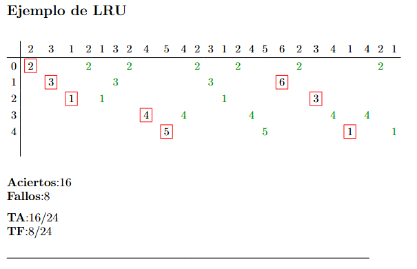
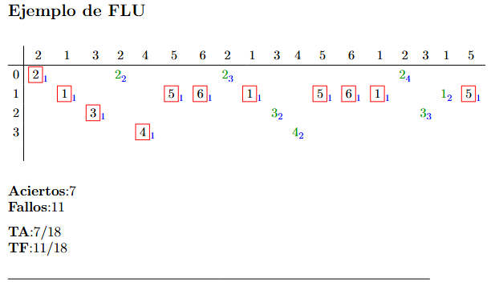

# MCTables
*by Conde Lucento, 2026*

  

---

## 🇪🇸 Español

### MCTables: Un paquete de LaTeX para sustituciones en caché de memoria

**MCTables** es un paquete de LaTeX especializado diseñado para automatizar y agilizar la visualización de los **Algoritmos de Reemplazo de Páginas** (como FIFO, LRU y FLU) utilizados en estudios de **Sistemas Operativos** y **Arquitectura de Computadoras**.

El paquete elimina el proceso tedioso y propenso a errores del formateo manual de tablas al proporcionar un entorno estructurado que maneja la lógica y el diseño simultáneamente.

### Características principales

#### Contabilidad automatizada
Incluye contadores integrados que rastrean automáticamente los **Aciertos (Hits)** y **Fallos (Faults)** a lo largo de la secuencia.

#### Métricas de eficiencia
Calcula automáticamente:

- **Tasa de Aciertos (TA)**
- **Tasa de Fallos (TF)**

al final de cada tabla.

#### Lenguaje visual intuitivo

Presenta comandos dedicados para resaltar:

- **Fallos** → resaltados con un **borde rojo** para su identificación inmediata.  
- **Aciertos** → representados en un **color verde distintivo**.
 

  

#### Metadatos FLU
Soporte específico para **subíndices de Frequency Least Used (FLU)** para rastrear el recuento de apariciones de páginas.

  

#### Estructura flexible
Admite:

- etiquetas de marcos personalizadas  
- longitudes de secuencia variables  
- integración con la **Tabla de Contenidos (TOC)**

---

### El asistente de Python

Escribir tablas de LaTeX complejas manualmente puede ser abrumador.  
Para mejorar la experiencia del usuario, este proyecto incluye un **generador basado en Python**.

Los usuarios simplemente pueden:

1. Introducir el **número de marcos**.
2. Introducir la **secuencia de páginas**.

El programa genera automáticamente el **código LaTeX listo para pegar**, asegurando una **precisión del 100 % en la representación del algoritmo**.

Puedes acceder al código fuente en los archivos del repositorio o bien usar el [Google Colab]([https://direccion.com](https://colab.research.google.com/drive/1DqE3bAAjAlz3yKFjbnRlixUpJeXvZfDs?usp=sharing))

---

## 🇬🇧 Package Description (English)

### MCTables: A LaTeX Package for Memory Cache Substitutions

**MCTables** is a specialized LaTeX package designed to **automate and streamline the visualization of Page Replacement Algorithms** (such as FIFO, LRU, and FLU) used in **Operating Systems and Computer Architecture** studies.

The package eliminates the **tedious and error-prone process of manual table formatting** by providing a structured environment that handles **logic and layout simultaneously**.

### Key Features

#### Automated Accounting
Includes built-in counters that automatically track **Hits** and **Faults** throughout the sequence.

#### Efficiency Metrics
Automatically calculates:

- **Hit Rate (TA)**
- **Fault Rate (TF)**

at the end of each table.

#### Intuitive Visual Language

Dedicated commands for highlighting:

- **Faults** → highlighted with a **red border** for immediate identification.  
- **Hits** → rendered in a **distinct green color**.
 

  

#### FLU Metadata
Specific support for **Frequency Least Used (FLU) subscripts** to track page appearance counts.

  

#### Flexible Structure
Supports:

- custom frame labels  
- variable sequence lengths  
- seamless integration with the **Table of Contents (TOC)**

---

### The Python Assistant

Writing complex LaTeX tables manually can be overwhelming.  
To improve usability, the project includes a **Python-based generator**.

Users only need to:

1. Enter the **number of frames**.
2. Enter the **page sequence**.

The script then generates **ready-to-paste LaTeX code**, ensuring **100 % accuracy in the algorithm representation**.

You can access the source code in the repository files or use the [Google Colab]([https://direccion.com](https://colab.research.google.com/drive/1DqE3bAAjAlz3yKFjbnRlixUpJeXvZfDs?usp=sharing))
